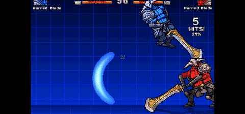
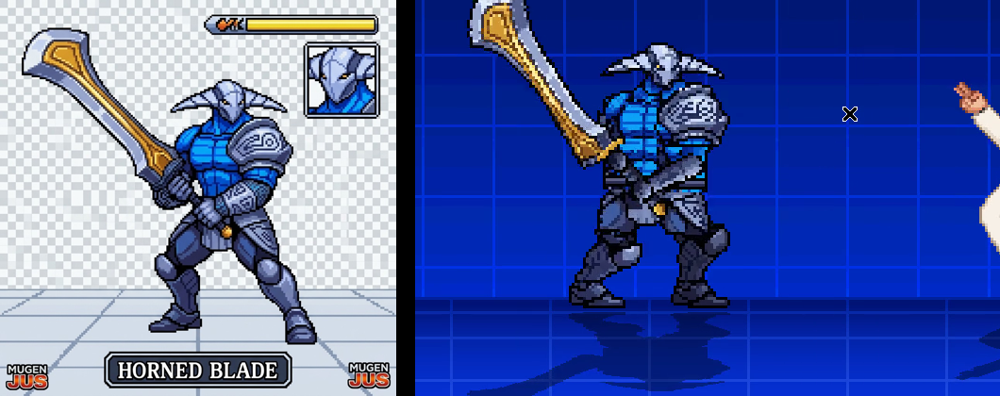

# Horned Blade — personaje para MUGEN (estilo JUS) con las habilidades de Sven

**Descarga directa:** [`HornedBlade_MUGEN_JUS.zip`](HornedBlade_MUGEN_JUS.zip). Descomprímelo en `mugen/chars/` y agrega `HornedBlade` a `data/select.def`. Requiere MUGEN 1.0, MUGEN 1.1 o Ikemen GO.





| Botón | Normal | Especial (estilo JUS) |
|---|---|---|
| a | combo de 3 tajos | — |
| b | Great Cleave (barrido amplio) | — |
| c | golpe demoledor (onda en el suelo) | adelante + c: embestida o agarre |
| x | — | **Storm Hammer** (aturde) · adelante + x: carga del martillo (Aghanim) |
| y | — | **Gran Hendidura** (onda de 2 golpes) · adelante + y: tajo ascendente |
| z | — | **Warcry** (+defensa, +velocidad, regeneración) |
| x+y | — | **God's Strength** (piel roja, ojos encendidos con destellos, daño ×1.8; 1 barra) |
| y+z | — | **Hendidura de Tormenta** (1 barra) |
| x+y+z | — | **Juicio del Caballero Errante** (ultimate, 3 barras) |
| mantener s | cargar poder | abajo + s: burla |

La lista completa de movimientos está en [`HornedBlade/LEEME.txt`](HornedBlade/LEEME.txt).

## Contenido

- `HornedBlade/`: el personaje listo para usar (DEF, CNS, CMD, AIR, SFF v1, SND y 6 paletas ACT).
- `preview/`: animaciones y capturas de prueba en el motor Ikemen GO.
- `generator/`: el código que generó todo a partir de `reference.jpg`.

## Cómo se generó

1. `extract.py` separa al personaje del fondo, reconstruye la rejilla de pixel art nativa (200×200) y cuantiza la paleta.
2. `parts.py` recorta cabeza, torso, hombrera, piernas y espada, y dibuja por código los brazos, puños y empuñadura.
3. `rig.py` es un esqueleto 2D (FK/IK) que coloca las partes y las rasteriza con supermuestreo y voto por moda, para que el resultado siga siendo pixel art de paleta. También dibuja las estelas de la espada.
4. `poses.py` define todas las animaciones (más de 130 acciones). `build.py` las renderiza, calcula las cajas Clsn1/Clsn2 y escribe el SFF, el AIR, el SND y las paletas ACT.
5. `fx.py` genera los efectos (rayos, explosión, ondas, auras y paneles de super). `sounds.py` sintetiza los sonidos, y las voces en español se hacen con espeak-ng.
6. `lint.py` verifica las referencias cruzadas (estados, animaciones, sprites, sonidos y comandos). `package.py` normaliza los textos (CRLF/ASCII) y crea el ZIP.

```bash
cd mugen/generator
python3 extract.py && python3 build.py && python3 lint.py && python3 package.py
```

Dependencias: Python 3 con numpy, Pillow y scipy, más `espeak-ng` para las voces.
