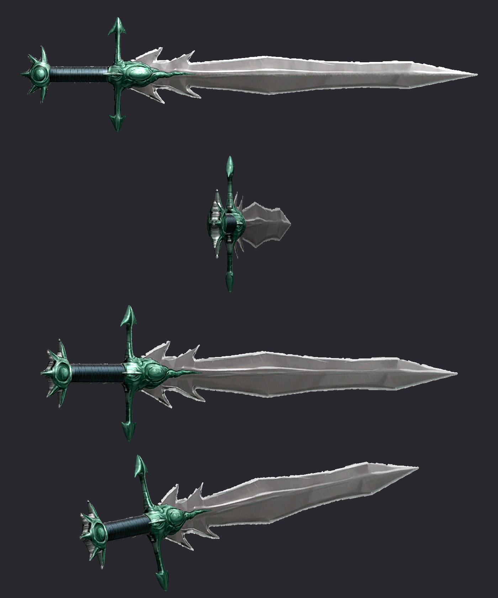

# Ludo Kressh Sword — mod para Skyrim Special / Anniversary Edition

Espada de una mano con el modelo de la imagen de referencia (pomo con púas, empuñadura negra
encordada, guarda verde con puntas de flecha y hoja plateada con dientes). Todos sus ataques
están imbuidos en veneno.



## Instalar con Vortex

1. Descarga **`dist/LudoKresshSword-1.1.zip`**.
2. En Vortex abre **Mods** y arrastra el zip a la zona *Drop File(s)* (o usa *Install From File*).
3. Pulsa **Enable** y después **Deploy**.
4. En **Plugins**, comprueba que `LudoKresshSword.esp` está activado.

El plugin lleva la marca ESL (ESPFE), así que no ocupa un hueco de tu orden de carga. Solo
necesita `Skyrim.esm`, sin SKSE ni otros requisitos.

## Cómo conseguirla

- **Forja (sin requisito de perk):** 3 lingotes de ébano, 1 corazón de daedra, 2 campanillas
  de la muerte (*Deathbell*) y 2 tiras de cuero. Sale en la categoría *Ébano*.
- **Mejorarla en la piedra de afilar:** 1 lingote de ébano. La perk *Herrería de ébano* duplica
  la mejora, como con cualquier arma de ébano.
- **Consola:** `help "Ludo Kressh" 4` y luego `player.additem <ID> 1` con el ID del arma (WEAP)
  que muestra el comando. Al ser ESL, el ID tiene la forma `FEXXX804`.

## Estadísticas

| | |
|---|---|
| Tipo | Espada de una mano (habilidad Una mano) |
| Daño | 24 (la espada daédrica tiene 14) |
| Peso / valor | 14 / 3500 |
| Velocidad / alcance / aturdimiento | 1.0 / 1.0 / 0.85 |
| Daño crítico | 12 |

**Encantamiento «Veneno Sith»**, que se aplica en cada golpe:
- *Veneno de Ludo Kressh:* 12 puntos de daño por segundo durante 5 s (60 en total).
- *Toxina Sith:* drena 10 puntos de aguante por segundo durante 5 s.
- La resistencia al veneno lo reduce. El coste del encantamiento es 0, así que **nunca se
  descarga** y no hay que recargarlo con gemas de alma.
- Lleva el brillo verde de encantamiento vanilla (`EnchGreenFXShader`) y el efecto de impacto
  del veneno de chaurus. No se puede desencantar.

## Contenido del mod

```
LudoKresshSword.esp
meshes/weapons/LudoKressh/LudoKresshSword.nif      (modelo 3ª y 1ª persona + colisión Havok)
textures/weapons/LudoKressh/LudoKresshSword.dds    (difusa, DXT1 2048x512)
textures/weapons/LudoKressh/LudoKresshSword_n.dds  (normales + especular, DXT5)
textures/weapons/LudoKressh/LudoKresshSword_m.dds  (máscara de reflejo metálico)
```

## Cómo se generó (por si quieres modificarlo)

Todo se genera con los scripts de `tools/` a partir de `reference/ludo_kressh_sword_ref.png`:

- `gen_mesh.py`: recorta la silueta de cada pieza y la triangula. Le da volumen así: la hoja
  con sección de diamante y filo; la guarda, la empuñadura y el pomo con sección redondeada.
  La empuñadura se acorta un poco respecto a la imagen para que sea manejable a una mano.
- `gen_textures.py` y `dds.py`: generan las texturas DDS con mipmaps.
- `build_nif.py` y `fix_nif.py`: escriben el NIF de Skyrim SE con
  [PyNifly](https://github.com/BadDogSkyrim/PyNifly)/nifly. El nodo `Prn = WeaponSword`, los
  BSXFlags, el shader con cubemap y la colisión (cajas Havok, capa WEAPON) siguen a las armas
  vanilla.
- `build_esp.py`: escribe el plugin. Los formatos de registro siguen las definiciones de xEdit
  y los FormID vanilla salen de `Mutagen.Bethesda.FormKeys`.
- `nifcheck.py`, `tanframe.py` y `MutagenCheck.cs`: validan los archivos. `nifcheck.py` es un
  lector independiente basado en `nif.xml` y `MutagenCheck.cs` lee el ESP con Mutagen.
